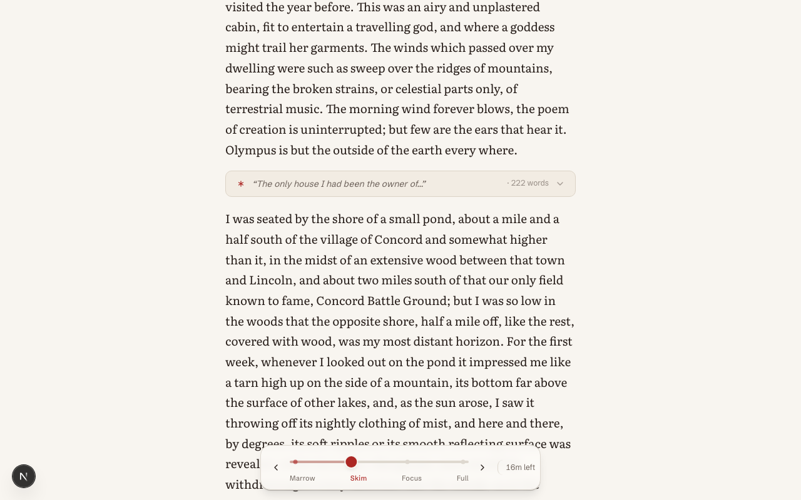

# Marrow

A density slider for non-fiction. Slide it left and the padding folds away until only the argument is left, every word still the author's.

**[Try it →](https://marrow-ecru.vercel.app)**



Most non-fiction is padding. A book with forty pages of argument in it will happily run to two hundred, and you end up skimming, guessing what's safe to skip while you skip it. Marrow gives you a dial instead. The whole book is always there. Slide it left and the low-signal passages dim, then fold into a one-line marker you can tap to reopen, then drop away, until what's left is the spine of the chapter. Slide back and the full text returns.

The one rule it never breaks: every word on screen is the author's, exactly as written. Marrow never paraphrases and never rewrites. When a passage collapses, the marker it leaves behind is that passage's own opening words, quoted, never a summary.

## How the analysis works

No account, no API key, no network. Marrow reads each chapter on your device in a few milliseconds and tiers every passage with a heuristic that blends three signals:

- **Centrality** — a windowed TextRank over a block-similarity graph. Passages the rest of the chapter keeps leaning on score higher.
- **Salience** — Luhn-style density of the chapter's significant terms.
- **Novelty** — where an important idea first shows up.

Structure does the rest. It reads the book's own headings, leans on section openings, and tells an argument from a story so it rewards different things in each.

It's honest about its edges. It's sharpest on argument-driven non-fiction, where claims and definitions leave tracks on the surface. It's softer on narrative, fiction and memoir, where the pivotal sentence can look like nothing at all. So point it at the books you read for the argument, not the prose.

## The four settings

| Setting | What you see |
| --- | --- |
| **Full** | The whole book, untouched. |
| **Focus** | The padding dims. Nothing hidden. |
| **Skim** | Anecdotes and asides collapse into gist pills you can tap open. |
| **Marrow** | Only the load-bearing sentences and headings remain. Two to four minutes a chapter. |

Density changes are live and reversible, and they never lose your place: whatever you're reading stays pinned in the viewport as everything around it folds away.

## Stack

Next.js (App Router) and React, Tailwind for styling, Motion for the slider physics, Dexie over IndexedDB for storage, and JSZip with the native DOM parser for EPUBs. It's entirely client-side. There is no backend.

## Run it

```bash
npm install
npm run dev
```

Open `http://localhost:3000`, import a DRM-free EPUB or try one of the bundled samples, and slide.

## Deploy

It's a standard Next.js app and deploys to Vercel with no configuration. Everything runs in the browser, so there's nothing to provision and no secrets to set.

## Notes

Marrow opens DRM-free EPUBs only. Your books never leave your device; the parsed text, your reading position, and your bookmarks all live in the browser's IndexedDB. The bundled sample books (Alice's Adventures in Wonderland, Frankenstein, Walden) are public domain, via Project Gutenberg.

## License

MIT.
